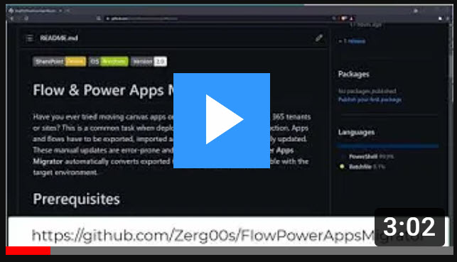
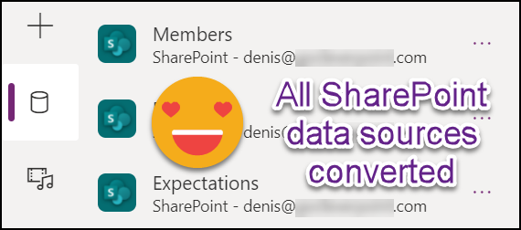
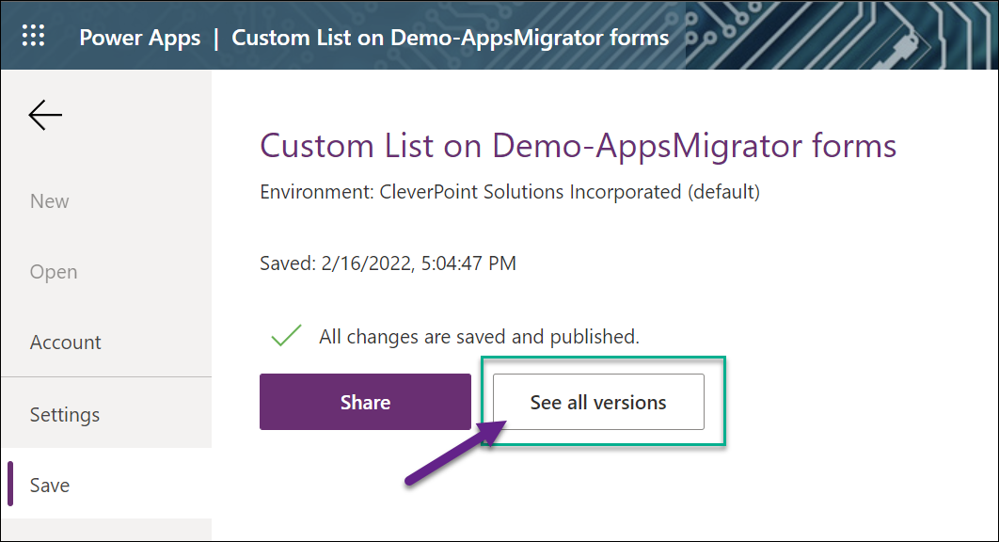
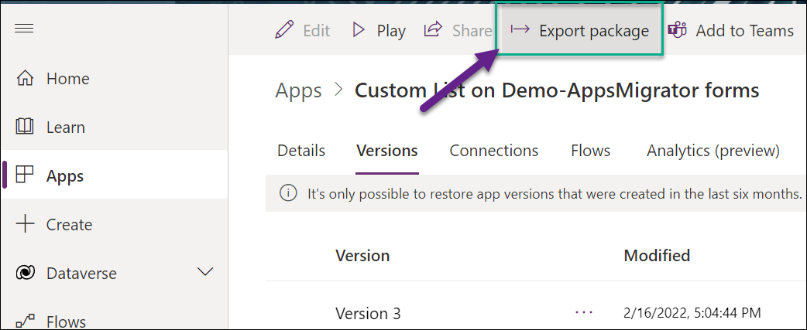
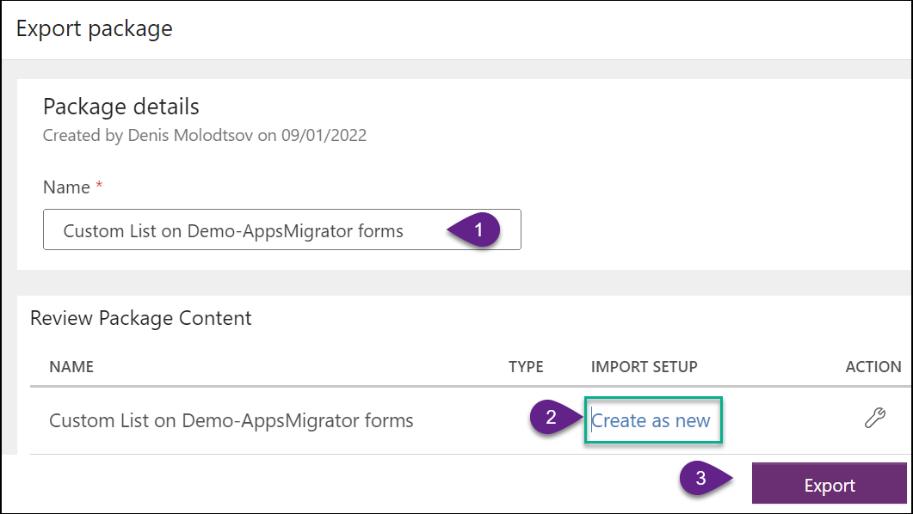

 

# Flow & Power Apps Migrator

Have you ever tried moving canvas apps or cloud flows across Microsoft 365 tenants or sites? This is a common task when deploying apps and flows to production. Apps and flows have to be exported, imported and SharePoint actions manually updated. These manual updates are error-prone and labor intensive. **Flow & Power Apps Migrator** automatically converts exported flows and apps to be compatible with the target environment. 

Flow & Power Apps Migrator also helps you migrate **SharePoint lists** that are used as a dependency for your Apps and Flows. There is an interactive UI form that lets you do just that.

Finally, the Flow & Power Apps Migrator converts **SharePoint List Forms customized with Power Apps**. 

## Watch a Demo 

# Prerequisites 

- [PowerShell 5.0 or later](https://docs.microsoft.com/en-us/powershell/scripting/windows-powershell/install/installing-windows-powershell?view=powershell-7.2). 
- Make sure that SharePoint site exist in the target environment. You don't have to create Lists and Libraries because this tool will do it for you.
- [Download the latest version of the Flow & Power Apps Migrator](https://github.com/Zerg00s/FlowPowerAppsMigrator/releases).
- Extract the ZIP package.

## Migrate-able artifacts

| Artifact      | Support |
| ----------- | ----------- |
| Standalone Canvas Power Apps | ✔       |
| Customized SharePoint List Forms Canvas apps | ✔ This works again since September 2022   |
| Canvas Power Apps that trigger Flows  | ✔ (flows are also migrated)       |
| Standalone Cloud Flows   | ✔        |
| Standalone Desktop Flows   | ❌        |
| Standalone Model-driven apps   | N/A (not tested)        |
| Solutions containing multiple canvas apps and flows  | ✔        |
| SharePoint Lists   | ✔        |
| SharePoint Libraries   | ✔        |
| Modern JSON List customizations  | ✔        |
| SharePoint data   | ❌       |
| Content Types   | ✔ (migrated automatically)     |
| Lookup fields   | ⚠️ (migrated only if you migrate the lookup list too)        |
| Data Sources located in a single site  | ✔        |
| Data Sources located in multiple sites and sub-sites   | ❌        |

# Convert flows, apps and solutions

## Export flows, apps and solutions
Export all of your flows:

Export all of your apps:

## 2. Place exported flows, apps and solutions in the src folder

## 3. Run Migrate-Packages.bat
The scripts will iterate through all ZIP files inside the `\src` directory and convert them to be compatible with the new Microsoft 365 tenant or site.
- Run `Migrate-Packages.bat` script

- Enter source site URL and target site URL:
- Keep `MIGRATE_LISTS` property set to `True` if you want to migrate SharePoint lists and libraries.

- Select lists and libraries to migrate

- Sit back and wait for the lists and libraries to be migrated and the conversion process to finish.

## 4. Navigate to the \dist folder and collect converted flows, apps and solutions

## 5. Import converted flows, apps and solutions
Now go ahead and import your flows and apps to the destination tenant. All SharePoint actions are now be converted and point to the new location.

###  <b>Power Apps</b> data sources are all converted

### <b>Flow actions</b> are also converted

## How it works

**Flow & Power Apps Migrator** finds all unique IDs pointing to the source SharePoint site and replaces them with the destination IDs. `resourceMapping.csv` contains the mapping of these IDs.

## Limitations

- Does not support macOS and Linux.
- Only SharePoint data sources are updated.

# Preparing a deployment package for your Clients and Partners

What if you created an app or a flow that you want your Client or Partner to also have? You probably want to package your SharePoint Lists along with the apps and flows in a single package. Then you want to hand over this package along with simple installation instructions. Guess what? There is a script that prepares this package automatically for you.

`Prepare-Deployment-Package-for-Client.bat` script prepares a deployment package that you can share with your Clients or Partners. 

## On your end

- Run `Prepare-Deployment-Package-for-Client.bat`

- Export your Solutions, Power Apps and Flows and save them to the `package\src` directory

- Send the `package` directory to your Client or Partner.  

## On the Client's side

- If not already exists, create a SharePoint Online site. It will contain SharePoint Lists and Libraries that Power Apps/Flows require.
- Open the `package` directory.
- Run `Convert-Packages.bat` script. 
- Provide target site URL.
- Import all solutions, flows and apps from the `dist` directory.

**Note:** `Convert-Packages.bat` will:

- Deploy SharePoint lists and libraries (if you want to package them)
- Convert Apps and Flows from `src` and saves them to 'dist'.

# Migrating Power Apps SharePoint List Form

SharePoint List forms customized with Power Apps can be migrated if you follow these steps:

- Navigate to your SharePoint List
- Click on one of the SharePoint list items
- Click on ellipsis (3 dots) > Customize with Power Apps:

- Power apps Editor will open.
- Click on File > See all versions

- Click Export package:

- Type your app name
- Select "Create as new" under Import setup
- Click Export

- Place the exported package in the `\src` directory
- Run `Migrate-Packages.bat` script

# Latest Updates
### 3.8.2 Version - 2022-09-28

#### Changes
- Added a check of the source and target site permissions. If the user does not have the required permissions, the app migrator will stop and display an error message.

#### Known issues
- Occasional error: [Access is denied (Exception from HRESULT: 0x80070005 (E_ACCESSDENIED))](https://github.com/Zerg00s/FlowPowerAppsMigrator/issues/34). This error is typically nothing to do with permissions. It is hard to diagnose, but one of the fixes is to delete a target site and rung the app migrator again.
- Migrated lists with custom content types end up with extra content type that should be deleted manually, after migration.
- Migrated lists might need fields to be added to the content type or a form.

# Latest Updates
### 3.8.1 Version - 2022-09-04

#### Bug fixes
- Fixed an issue with lists not being migrated

#### Known issues
- Migrated lists with custom content types end up with extra content type that should be deleted manually.
- Migrated lists might need fields to be added to the content type or a form.

### 3.8 Version - 2022-09-04

#### New features
- Added ability to Clear Credentials cache (useful when your credentials pop-up opens and closes automatically, without prompting you to enter your credentials)

#### Bug fixes
- Fixed an issue with migrating between non-English SharePoint sites. 

#### Known issues
- Migrated lists with custom content types end up with extra content type that should be deleted manually.
- Migrated lists might need fields to be added to the content type or a form.

### 3.7 Version - 2022-09-01

#### New features
- SharePoint list forms customized with Power Apps are now migrated by this tool. Credits to [kvadratnymedved](https://github.com/kvadratnymedved) and [amariak](https://github.com/amariak) for providing a solution. 🙏

#### Known issues
- Migrated lists with custom content types end up with extra content type that should be deleted manually.
- Migrated lists might need fields to be added to the content type or a form.
- Flow & Apps Migrator might cache your user credentials and not prompt you for them again. In this case, you will need to to follow the steps [described in this issue](https://github.com/Zerg00s/FlowPowerAppsMigrator/issues/25)

### 3.6 Version 

#### New features
- Added an ability to migrate flows that refer to the List and Library views. This was done to address the issue [List Views not Migrated](https://github.com/Zerg00s/FlowPowerAppsMigrator/issues/22) submitted by [Juistin](https://github.com/C2C-Justin)

#### Known issues
- SharePoint list forms customized with Power Apps are no longer migrated by this tool. There is an issue I am still working on.

### 3.5 Version 

#### New features
- Added an ability to migrate content types and columns. These will be automatically migrated if your lists have any custom content types.

#### Known issues
- SharePoint list forms customized with Power Apps are no longer migrated by this tool. There is an issue I am still working on.

### 3.4 Version 

- Fixed a major bug preventing export-importing for the lists and libraries.

### 3.3 Version 

- Made console output more clear.

### 3.1 Version 

- Fixed a bug that corrupted solution zip files during the conversion process. It made it impossible to import solutions.

### 3.0 Version - Major update

New features added:

- `Migrate-Packages.bat` script now migrates SharePoint lists and libraries that your Apps and Flow depend on.
- Added `Prepare-Deployment-Package-for-Client.bat` script that lets you prepare a deployment package that you can share with your Clients or Partners. Running this script will generate a package directory that you can then send to your Clients and Partners. Distribution of your apps and flows is now easier than ever.

### 2.1 Version

New feature added:

- added support for solution migration. Thanks to [Mark Doria](https://www.linkedin.com/in/mark-doria/) for helping with this feature.

## Support this project 
I like coffee and consume lots of it while coding. If you want to support me, you can click on the "buy me a coffee" button:

 

   

  
